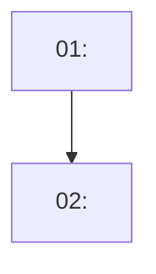

Plan the team for: $ARGUMENTS

**Planning only. You write exactly one file — `PLAN-TEAM.md` — and nothing else.** No code, no
migration, no component, no `INDEX.md` row, no task hydration, no teammate. If you find yourself
opening a builder's lane to fix something, you have left this command.

## Where it sits, so nobody runs the wrong one

| Command | The question it asks | Writes |
|---|---|---|
| `/spec` | What are we building, and what is cut? | `SPEC.md` |
| **`/plan-team`** | **Who builds which part of it, in what order, and what can actually run at once?** | **`PLAN-TEAM.md`** |
| `/execute:implement` | Build it — one lane, one agent. | code · `RESULT.md` |
| `/execute:team` | Build it — both lanes, live teammates, driven end to end. | code · `RESULT.md` |

**Run this only when the work genuinely splits across `supabase/**` and `web/app/**`.** A unit that
fits one lane goes straight to `/execute:implement`; a plan document for it is overhead the brief
grades against you — output per hour is assessed and more hours is explicitly not a better score.

`/execute:team` §3 does its own decomposition when no plan exists. **If `PLAN-TEAM.md` is present it
decomposes from that instead** — that is the handoff, and it is the only reason this file is worth
writing. Two commands deriving the task graph independently is the drift `INDEX.md`'s "status lives
in one place" rule exists to prevent.

## 1. Find the spec

Default: the highest-numbered `docs/analysis/<nnn>-<slug>/` containing a `SPEC.md` and no
`PLAN-TEAM.md`.

- **No `SPEC.md` → stop.** Say "run `/spec` first" and do nothing else. Do not infer a spec from
  `BRIEF.md`, from `INDEX.md`, or from this conversation. Planning a build from an unwritten spec is
  how the wrong thing gets built confidently.
- **`PLAN-TEAM.md` already exists → stop** and ask whether to revise it. Someone may be building
  from it.
- **A spec awaiting approval is not an approved spec.** Check its `INDEX.md` Pending row. You may
  still plan it — say in the report that every task is **blocked pending owner approval** and that
  no teammate is assigned until the row flips.

## 2. Read, then run the gate yourself

Read `SPEC.md` **in full**, including its CUT list and its decision log. Then `INDEX.md` (Board,
Pending, Known issues) and `docs/analysis/FINDINGS.md` for the findings the spec traces to.

Then find the spec's **build-order step 1** — `/spec` requires whatever could invalidate the plan to
go first. **Run it before you write a line of the plan.** If it fails, the spec is wrong and there
is nothing to plan; report that. It is a successful outcome for this command.

**Re-run the script behind any number you are about to put in the plan.** Numbers in prose drift.

No research subagents. Both lanes together are ~30 tracked files — `git ls-files supabase web/app`
reads faster than a fan-out reports, and the pasted original's three-agent recon phase was sized for
a codebase that is not this one.

## 3. Assign lanes that cannot collide

Two teammates editing one file is an overwrite. The lanes are disjoint by construction; the plan's
job is to keep them that way.

| Teammate | Agent type | Model | Owns |
|---|---|---|---|
| `be` | `be-builder` | opus | `supabase/**` — migrations, RLS, RPC, seeds, `config.toml`, Edge Functions · pipeline scripts under the unit folder · regenerated `docs/analysis/outputs/` |
| `fe` | `fe-builder` | sonnet | `web/app/**` — `src/`, `index.html`, `vite.config.ts`, `tsconfig.app.json`, `package.json` |
| `check` | `reviewer` | opus | nothing — read-only conformance between phases |

There is no `api-builder`: Edge Functions are `be-builder`'s. There is no database research agent;
`be-builder` invokes the `supabase` and `supabase-postgres-best-practices` skills itself.

**The lead alone writes `INDEX.md`.** Nobody writes `docs/analysis/FINDINGS.md` or `docs/brief/**`.
Assign no task that would require either.

**Work the spec reserves for the owner** — a hand-written artifact, an `env` variable, a deploy, a
`vercel` setting — is a task with **no assignee**, named as an owner task. Do not hand it to a
builder to unblock the graph.

## 4. Sequence honestly — do not manufacture parallelism

One task per build-order step; split a step only where it genuinely spans both lanes. **The spec's
own gates are the dependency graph** — read them out of §Build order, do not invent a phase table
that looks balanced.

- Anything that could invalidate the plan is step 1 and blocks everything.
- A step that produces the data another step renders is a hard block, not a soft one. A
  four-column phase table over a chain that is strictly sequential is a plan that deadlocks on its
  own dependencies.
- Fan out only where the spec's outputs genuinely separate — screens, panels, tables, and the
  writing that describes them.
- Aim for **5–6 tasks per teammate.** Smaller and coordination costs more than it saves; larger and
  a teammate works for an hour in a direction nobody checked.
- `check` runs at each phase boundary. It is the fast in-team check, **not** the Codex gate — that
  is `/execute:team` §6, and an unavailable reviewer is unknown, never a pass.

## 5. Write `PLAN-TEAM.md` beside the spec

```markdown
---
created: <YYYY-MM-DD>
updated: <YYYY-MM-DD>
note: One sentence — what changed and why. Overwritten in place, never appended.
---

# <title> — team plan

Planned <YYYY-MM-DD> from `SPEC.md` in this folder. Approval state: <approved | awaiting approval>.

## Overview
Two or three sentences: what this build produces and which spec thesis it proves.

## Lanes
Only the teammates this build needs, each with the paths it owns and the paths it must not touch.
Name the owner tasks here too, with no assignee.

## Build gate
The spec's build-order step 1, what it would invalidate, and its result if it has been run.
(Not the document gate — that one is Codex reading this plan, and it leaves no section here.)

## Dependency graph


## Phases
| Task | Lane | Title | Spec § | Blocked by | Size |
|---|---|---|---|---|---|
| 01 | be | <title> | §10.1 | — | M |

Each phase ends with a `check` pass. Say what it verifies, not that it verifies.

## Tasks
### 01 — <title>
- **Lane:** be | fe | owner
- **Spec section:** §<n>
- **Depends on:** none | 01
- **Acceptance criteria:** <lifted from the spec, checkable — "the panel shows the assigned class
  and whether the threshold agrees", not "the panel is good">
- [ ] <subtask>

## Critical path
`01 → 03 → 05`, and what it is waiting on.

## What this plan does not cover
Anything on the spec's CUT list that a builder might reasonably think is in scope, plus anything
the plan could not sequence and why.
```

Both dates are today's, and `note` says in one sentence what this plan settles.
`.claude/hooks/unit-frontmatter.sh` maintains `updated` afterwards; it cannot author `note`.

## 6. The document gate — an independent read before anyone is spawned

Last step before the report, and it is not optional. It is the same reviewer `/execute:team` §6 runs
after the build, pointed at the plan instead of the diff — a second reader who has the spec and the
plan and no stake in the plan being good:

```bash
bash .claude/hooks/codex-interview.sh refine docs/analysis/<nnn>-<slug>/PLAN-TEAM.md docs/analysis/<nnn>-<slug>/SPEC.md
```

First argument is the plan, second is the spec it must decompose without adding to. Codex is
read-only and ephemeral: it judges, it does not re-plan. Its last line is
`VERDICT: READY TO BUILD | GAPS | NOT READY`.

| Exit | Meaning | What to do |
|---|---|---|
| 0 | Codex ran; the report is its verdict | Check every material finding against the plan and the spec yourself. **Codex saying it is not evidence.** |
| 2 | A path is wrong, or one of the two files is not there | Fix it and re-run. Do not skip. |
| 3 | Codex did not complete, or the operator kill switch is set | Report **"plan unreviewed — reviewer unavailable"**. Never a pass. |

Act on the verdict:

- **READY TO BUILD** — say so, and name what you checked and rejected.
- **GAPS** — fix what you accept **in `PLAN-TEAM.md` now**. A dependency Codex says will deadlock is
  cheaper to fix here than at the point two teammates are already running. If the gap is in the
  *spec* rather than the plan, say so and route it back — do not paper over a spec hole with a
  planning workaround.
- **NOT READY** — **do not tell the owner to run `/execute:team`.** Name what has to change first.

An unavailable reviewer is unknown, never approval. **A spec still awaiting owner approval is not
made approved by a `READY TO BUILD`** — Codex reviews documents, it does not approve scope.

## 7. Rules

- **Acceptance criteria come from the spec.** If a task needs a criterion the spec does not carry,
  the spec is incomplete — say so in the report rather than inventing one here.
- **Do not restate the honesty rules.** `.claude/agents/{be,fe,reviewer}-builder.md` already carry
  the band `[43.2%, 64.7%]`, the contested figures (`INDEX.md` #1, #6, #7), the ban on implying a
  query→deal join, and abstention-before-adjacency. A second copy in a plan document is a copy that
  drifts. Reference them; flag only a task where one is at live risk.
- **Nothing cut comes back.** Scope added back is scope nobody approved, and it is the failure this
  repo watches for.
- **No `INDEX.md` row and no decision row.** This command decides nothing — it sequences decisions
  the spec already made. If planning genuinely settled something the spec left open, that is a
  finding about the spec: name it in the report and let the owner amend the spec.
- **A plan that cannot fail was not specific.** Name what would make it wrong.

## 8. Report, ≤7 lines

Plan path · the build gate and what it blocks · lanes and task counts · **what is strictly
sequential and therefore the critical path** · owner tasks nobody can be assigned · **Codex's
verdict, what you changed in response, or that the reviewer was unavailable** · the next command
(`/execute:team <nnn>-<slug>`, or `/execute:implement` if the plan collapsed to one lane).
