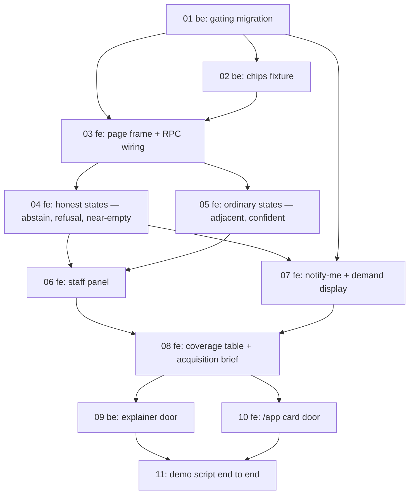

# The screens — team plan

Planned 2026-08-07 from `SPEC.md` in this folder. Approval state: **approved by the owner
2026-08-07**, together with the alternatives floor recorded as SPEC decision 18.

## Overview

Builds the Part B prototype: a realistic Groupon page at `/app#prototype` rendering the five states
`search_deals` returns, reached from the explainer landing page. It proves the spec's thesis — that
abstain, at 46.7% of search volume, is the product rather than the error page — and it is the last
dependency Part C is waiting on.

## Lanes

| Teammate | Agent | Owns | Must not touch |
|---|---|---|---|
| `be` | `be-builder` (opus) | `supabase/**` (migration, RLS, RPC, view), the chips fixture script under this unit folder, `docs/analysis/004-data-story/{explainer.template.html,build_explainer.py}` + its regenerated `outputs/` | `web/app/**` |
| `fe` | `fe-builder` (sonnet) | `web/app/**` — `src/`, `app.html`, `vite.config.ts`, `tsconfig.app.json` | `supabase/**`, the explainer template |
| `check` | `reviewer` (opus) | nothing — read-only between phases | everything |

The lead alone writes `INDEX.md`. Nobody writes `FINDINGS.md` or `docs/brief/**`; no task here needs
either. Honesty constraints are already in `.claude/agents/*.md` and are not restated — the one at
live risk is flagged on task 04.

**Owner tasks, no assignee:**

- **O1 — push migrations 3 and 5 + reseed the remote.** `INDEX.md`: `query_embeddings` is still
  unapplied on `ewknlggenhrlftdukwme` and the remote carries the old seed (0 embeddings). Nothing a
  grader clicks works until this lands. Blocks the deployed demo, not the local build.
- **O2 — deploy a preview and `curl -I /app`.** The `/app` → `/app.html` rewrite is the one hop that
  cannot be proved locally (`vercel.json`, INDEX).
- **O3 — look at the page in a browser.** INDEX records the redesigned explainer has never been
  opened in one.

## Gate

Spec build-order step 1: the migration (`alternatives` · source check · policy flip · view recut).
It would invalidate the plan if the definer RPC could not keep writing `live` rows once the append
policy stops permitting them — every screen depends on the demand loop staying closed.

**Run 2026-08-07 in a rolled-back transaction against local. PASSES:**

- `demand_events` is `relforcerowsecurity = f`, owner `postgres`; `search_deals` is `prosecdef = t`,
  owner `postgres` → the definer path bypasses RLS. With the policy flipped to `notify_me` only, the
  RPC still wrote its `live` row (`paintball` GB → `abstain`, 1 row).
- The recut view returns `seed_searches = 222` for GB · London · adrenaline — the figure
  `001 SPEC` §5 cites, so the abstain state's "N searches in June" is implementable from it.
- City-stocked `alternatives` for `paintball` in London resolve to 3 rows with deal counts.

**The finding this raised is now RESOLVED** — those three alternatives were *Manicure & Pedicure*,
*Facial*, *Hair Styling* at 0.23–0.25: the closest thing GB London stocks to paintball is a
manicure. Owner decision 2026-08-07 (SPEC decision 18): **a 0.30 similarity floor**, above it the
labelled block, below it "nothing here is close" + category links. Verified against local: it
splits the 419 abstain pairs **186 show / 233 suppress**, and splits them meaningfully — adrenaline
suppresses (skydiving 0.215, rafting 0.179), `eyelash extensions` GB shows beauty at 0.396. Task 04
builds both branches.

## Dependency graph

## Phases

| Task | Lane | Title | Spec § | Blocked by | Size |
|---|---|---|---|---|---|
| 01 | be | Gating migration | Architecture, Build order 1 | — | M |
| 02 | be | Chips fixture from the band SQL | Criteria 1, 6 | 01 | S |
| 03 | fe | Page frame, route, doors' destination | Required behaviour, Build order 2 | 01, 02 | M |
| 04 | fe | Honest states: abstain · refusal · near-empty | Required behaviour, No good answer | 03 | L |
| 05 | fe | Ordinary states: adjacent · confident | Required behaviour | 03 | M |
| 06 | fe | Staff panel + side-by-side | Scope MUST, §8.7 | 04, 05 | L |
| 07 | fe | Notify-me write + demand display | Scope MUST, Criteria 3–4 | 01, 04 | M |
| 08 | fe | Coverage table + acquisition brief | Scope HIGH, Criteria 10–11 | 06, 07 | M |
| 09 | be | Explainer `#demo` door | Build order 8 | 08 | S |
| 10 | fe | `/app` Part B card door | Build order 8 | 08 | S |
| 11 | lead | Demo script end to end | Build order 9 | 09, 10 | S |

**Phase boundaries and what `check` verifies at each:**

- **After 02** — that the migration states the end ACL absolutely (`revoke all` then grant back, the
  `INDEX.md` 4.1 defect), that no applied migration was hand-edited, and that the chips fixture is
  generated rather than hand-typed.
- **After 05** — that the precedence rule is implemented as written: blank does not submit, an RPC
  error renders the error card rather than an empty state, and `near_empty` overrides its band.
- **After 07** — that an anon REST insert of `source='live'` fails, that `notify_me` succeeds, and
  that no rendered copy says "N people" where the data counts button presses.
- **After 10** — criterion 12 (`grep` for hardcoded headline numbers), the `DESIGN-SYSTEM.md` §11
  checklist, and that both doors point at `/app#prototype`.

## Tasks

### 01 — Gating migration
- **Lane:** be · **Spec section:** Architecture · **Depends on:** none
- **Acceptance criteria:** `search_deals` returns `alternatives` — top 3 services stocked in
  `p_city`, each `{title, category_l2, similarity, deal_count}`, computed always and rendered only
  below `confident`. An anon REST insert of `source='live'` fails; `source='notify_me', n=1`
  succeeds. `v_demand_by_cell` exposes `seed_searches` / `live_abstentions` / `notify_requests` and
  **no combined total**.
- [ ] `npx supabase migration new screens_rpc_v2` — never hand-edit an applied migration
- [ ] Iterate on the local DB, then `db pull --local`; state grants absolutely
- [ ] `db reset` and re-verify every criterion above from scratch

### 02 — Chips fixture
- **Lane:** be · **Spec section:** Criteria 1, 6 · **Depends on:** 01
- **Acceptance criteria:** a committed fixture carrying 15 band chips (one per market × band), 5
  near-empty chips and the 2 disagreement demos (`manicura` ES abstain-vs-stocked, `paseo en globo`
  ES adjacent-vs-absent), each generated by script from the band SQL, none hand-typed.
- [ ] Script under this unit folder; output committed; re-runs clean after `db reset`

### 03 — Page frame, route, RPC wiring
- **Lane:** fe · **Spec section:** Required behaviour · **Depends on:** 01, 02
- **Acceptance criteria:** `/app#prototype` renders as a realistic Groupon surface — wordmark, pill
  search with green circular submit, market/city selector defaulting GB · London, `Results for "X"`
  at 24px/800 with the count present even at zero. `/app` still renders with **no env configured**
  (the lazy-import discipline that `#stack` already relies on holds).
- [ ] Hash route + lazy import on `App.vue`'s existing pattern; no router dependency
- [ ] `@design` tokens + `prototype-theme.css`; alias already declared in both configs

### 04 — Honest states
- **Lane:** fe · **Spec section:** Required behaviour · **Depends on:** 03
- **Acceptance criteria:** abstain names the gap and the city, cites `seed_searches` only, shows the
  demand row written, and offers notify-me as the only green on the screen. **Both floor branches
  render** — `paintball` GB (0.251) suppressed with "nothing here is close" + category links,
  `eyelash extensions` GB (0.396) showing the labelled block — and the staff panel names which
  fired. Near-empty renders **panel first, deals below** — never a short grid. Refusal quotes the
  RPC's own `why`. No empty state blames a filter.
- **Live risk:** this is where abstention-before-adjacency is either implemented or quietly
  inverted. `check` reads the rendered order, not the intent.
- [ ] Floor is a named constant, not a literal in a template — it ships beside LOW/HIGH in the panel

### 05 — Ordinary states
- **Lane:** fe · **Spec section:** Required behaviour · **Depends on:** 03
- **Acceptance criteria:** confident is a plain unannotated grid; adjacent sits in the purple
  `#f5edfc` / `#d8b9f2` labelled container; `normalised=true` shows "we matched *{resolved_to}*".
  Deal card copied proportionally — 16:9, 8px radius, no border, no shadow.
- [ ] One deal-card component, reused by both states

### 06 — Staff panel
- **Lane:** fe · **Spec section:** Scope MUST · **Depends on:** 04, 05
- **Acceptance criteria:** shows the matched document + similarity, LOW/HIGH, **both** error rates,
  Part A's class and coverage, `band_agrees_with_part_a`, the S6a suppressed cross-city gate line,
  and the side-by-side **labelled illustrative**. Dark, monospace, 420px slide-over; "what the
  system does not know" set at equal weight to the scores.
- [ ] Default open; worth opening on every query

### 07 — Notify-me + demand display
- **Lane:** fe · **Spec section:** Criteria 3–4 · **Depends on:** 01, 04
- **Acceptance criteria:** notify-me writes `source='notify_me'` over REST with the publishable key;
  a second click cannot inflate the seeded baseline; the three source counts render separately.
- [ ] Copy says searches or requests, never "N people"

### 08 — Coverage table + acquisition brief
- **Lane:** fe · **Spec section:** Scope HIGH · **Depends on:** 06, 07
- **Acceptance criteria:** every row of `001 SPEC` §4 renders **including F6 marked cut with its
  reason**; the brief's top cell is GB · London · adrenaline from the recut view, with the
  lost-purchase figure computed at s2p 11.36% and labelled an upper bound.

### 09 — Explainer door
- **Lane:** be · **Spec section:** Build order 8 · **Depends on:** 08
- **Acceptance criteria:** `#demo`'s button is solid green, `href="/app#prototype"`, and
  `demo-status` no longer says there is nothing to click. Edited in `explainer.template.html` and
  regenerated by `build_explainer.py` — `outputs/` is never hand-edited.

### 10 — `/app` card door
- **Lane:** fe · **Spec section:** Build order 8 · **Depends on:** 08
- **Acceptance criteria:** the Part B card on `SiteIndex.vue` gains `href: '#prototype'` and a CTA in
  Part A's idiom.

### 11 — Demo script end to end
- **Lane:** lead · **Depends on:** 09, 10
- **Acceptance criteria:** the five `001 SPEC` §7 queries plus `paseo en globo` and one refusal all
  behave as the spec's state table says; hours logged.

## Critical path

`01 → 03 → 04 → 06 → 08 → 10 → 11`. Everything waits on the migration, and 08 waits on both the
staff panel and the demand loop. **This build is FE-heavy and that is real, not an artifact of
sequencing:** `be` holds 3 tasks and finishes early, so `/execute:team` should not hold the FE lane
waiting for it after 02. `check` at the 05 boundary is the one worth not skipping — precedence is the
finding Codex raised and the easiest thing to implement wrongly and never notice.

## What this plan does not cover

- **Anything on the spec's CUT list**, and one a builder will reach for: the cross-city travel/taxi
  offer. It is cut as a screen — 49 dead ends generous, 0 strict at >$150 — and exists only as the
  suppressed-gate line in task 06.
- **The agent** (`006 SPEC` §5), routes, a design pass beyond `DESIGN-SYSTEM.md`, and anything §8
  does not license (dark mode, a fourth confidence device, red for low confidence).
- **The remote and the deployment.** O1–O3 are the owner's, and until O1 lands every criterion here
  is verified against local only — which is the exact shape of this repo's last three defects.

## What would make this plan wrong

- If the 0.30 floor turns out to suppress the block on every query a grader actually clicks, the
  "labelled adjacency" half of `001 SPEC` §3 never gets demonstrated. The demo script must keep
  `eyelash extensions` in it for exactly that reason — drop it and the floor looks like a way of
  never showing alternatives at all.
- If `be` finishing early is read as slack and FE work is handed to it, the lanes collide on
  `web/app/**` and the disjointness this plan is built on stops holding.
